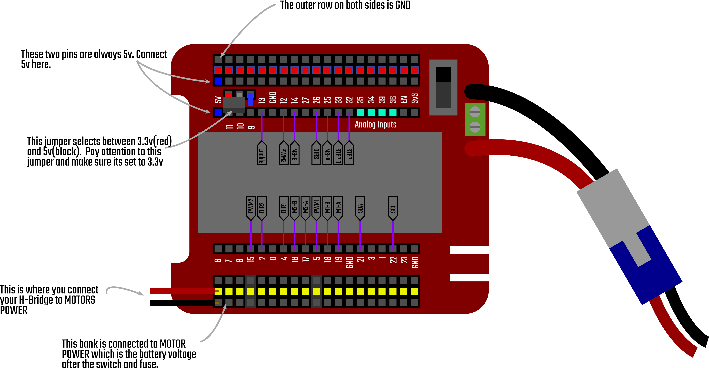
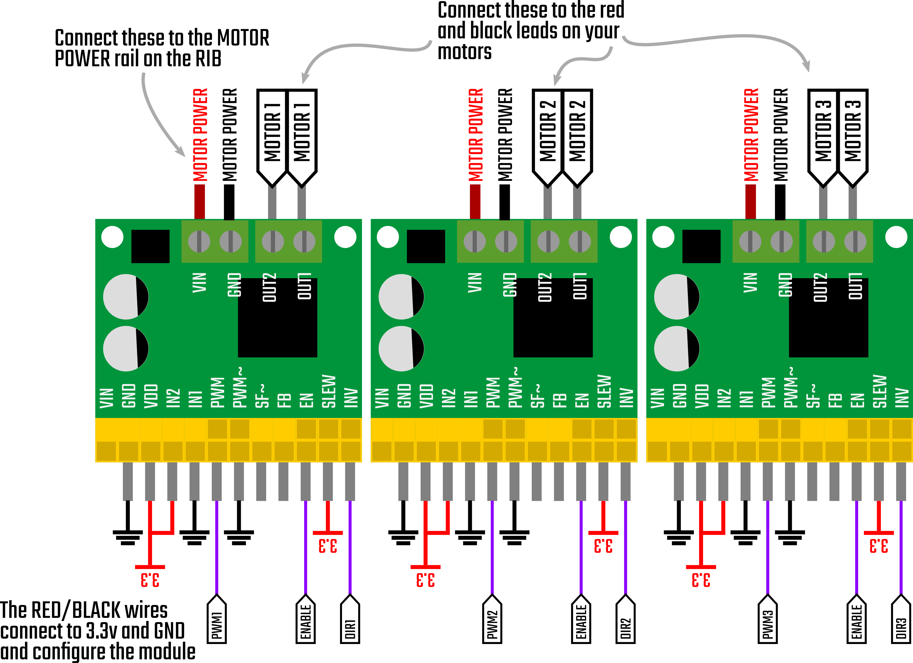
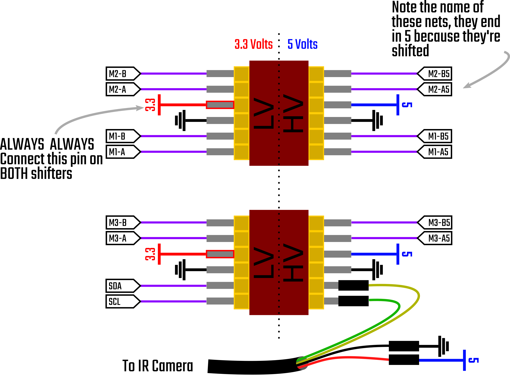
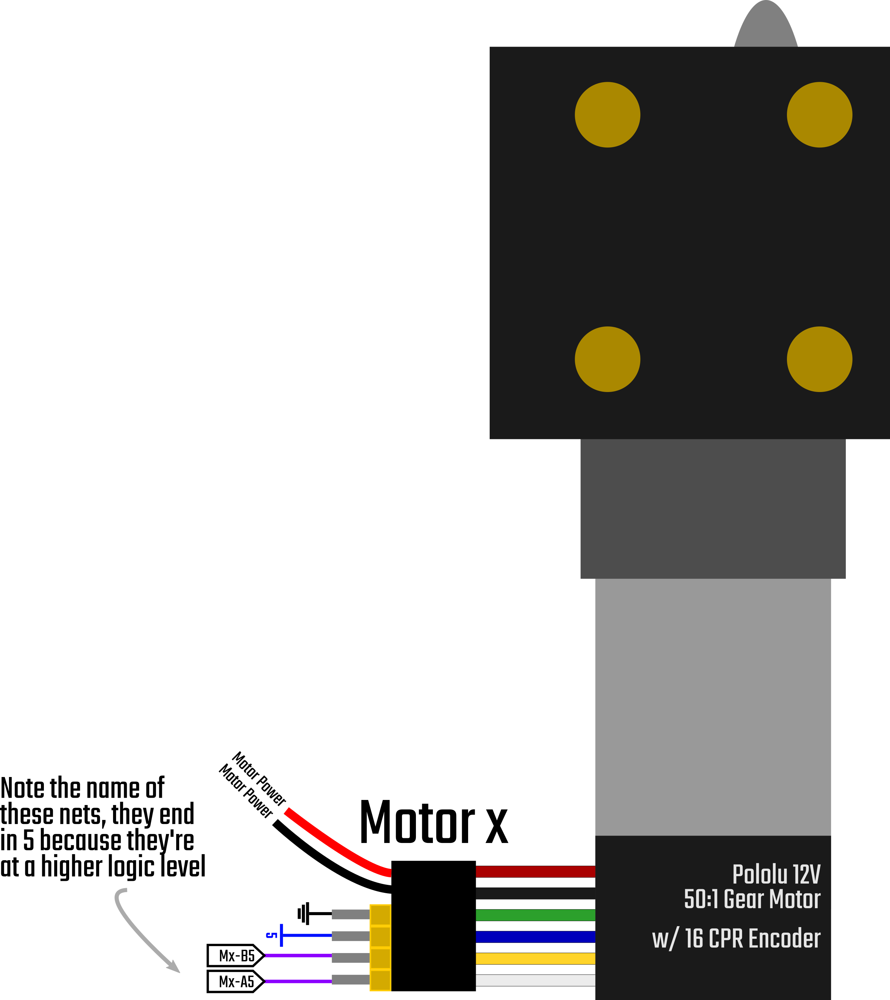

# Robot Wiring Diagram

This schematic is a simplified wiring diagram. Instead of direct connections we use net labels, little tags on wires, to indicate where they connect to.

Additionally, We use special symbols to denote ground and power connections.

Colors are used to indicate the type of signal. Purple signals are not voltage rails - they're outputs from encoders or inputs to other modules.

The colors BLACK, RED, BLUE, and YELLOW are used to indicate VOLTAGE RAILS.

Sometimes in the drawings a wire that is 12v is drawn as RED. This is because the wire on the physical part you are dealing with is red. This is true for the battery connection on the RIB and the connectors on the ESCs.

## Robot Interface Module

## H-Bridges

## Level Shifters

These level shifters shift the 5v encoder signals to 3.3v for the ESP. Check your wiring twice on this section because omitting the 5v or 3.3v connection can leave you with a damaged ESP.

## Motor Connections

